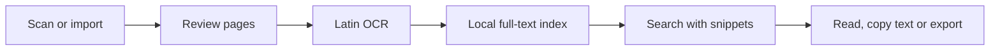

# DocuFlow

**Scan it once. Find it by what it says.**

A folder of document photos is easy to create and hard to search. Months later, the useful clue may be a word on the page rather than the filename you gave it.

DocuFlow turns scans, images and imported PDFs into a searchable Android document library. Latin OCR makes page text available to local search; titles, tags, categories and favorites provide another way back to the right document. Capture, reading and retrieval stay together on the device.

## A document's path through the app

**Capture and review.** Scan with perspective correction and enhancement, or import images/PDFs through the system picker. Rotate, trim, filter and reorder pages while keeping the original page sources available.

**Recognize and organize.** Run OCR per page, inspect the recognized text, and edit suggested names/categories. Tags and favorites support the way you organize your own library.

**Find and use.** Search across titles, page text, tags and categories. Snippets show where a match came from. Open the document, select OCR text, or export/share a multipage PDF.



## Keeping the library consistent

A single document spans image files, ordered page records, recognized text and a derived search index. Edits need to keep all four aligned.

[DocumentStore](app/src/main/java/com/noise/docuflow/data/DocumentStore.kt) updates metadata, page order and SQLite FTS4 entries in one transaction. File deletion follows the metadata commit, and unreferenced files older than 24 hours can be removed during cleanup. Search can be rebuilt from stored documents.

[DocumentController](app/src/main/java/com/noise/docuflow/DocumentController.kt) treats cancellation as part of the workflow: imports remove uncommitted files, short persistence steps finish before cancellation is delivered, and native OCR completes before its bitmap and recognizer are released. Missing source pages remain visible so the user can replace them.

The app bounds each document to 50 pages. PDF import uses seekable temporary storage with a 150 MB limit and rasterizes one page at a time. Library results are paginated without loading full OCR bodies. [Pipeline](docs/document-pipeline.md) · [Search](docs/search.md) · [Architecture](docs/architecture.md)

## Searchable library, portable page images

OCR text powers the local library. Export produces an A4 PDF of the visible pages, without a searchable text layer. Imported PDFs are rasterized, so original text layers and attachments are not retained. This is a page-based document workflow rather than a lossless PDF editor.

Documents live in private storage with backup/device transfer excluded. The app declares no network permission or document-upload integration. The scanner may download components through Google Play Services on first use; explicit sharing grants the selected recipient temporary access. [Privacy](docs/privacy.md)

## Try the complete loop

Use the configured JDK 25 / Android SDK 37 toolchain:

```bash
./gradlew assembleDebug
adb install app/build/outputs/apk/debug/app-debug.apk
```

Import a document with Latin text, run OCR, search for a word inside a page, then rename/tag it and export. This exercises the value of the library beyond the initial scan.

The [build record](docs/implementation.md) reports successful debug packaging and lint. Device acceptance testing and large-library profiling remain open. OCR does not cover Persian/Arabic; scanner support depends on Google Play Services and device resources. There is no extra document encryption, and uninstalling removes the library. No project license is selected.
